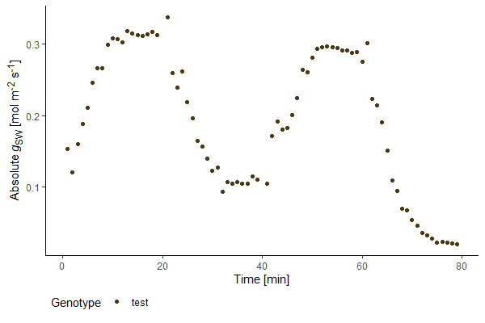

### Description

**Plot physiological parameters measured using the Li-COR biosystems photosystem.**

This package enables easy visualization of physiological parameters measured with a Li-COR portable photosystem.

It can plot absolute or relative stomatal conductance, carbon assimilation and water-use efficiency. Data from single files can be plotted as well as averaged data across several input files (with standard error bars) and different genotypes, species or conditions can be shown in one plot.

Licornetics is optimized for the use of Excel sheet files (**.xlsx**) created by the Li-6800 system.

As output, a plot is generated using the `ggplot2` package which can therefore be used downstream with ggplot-based packages such as `ggpubr`. Plot colours are added based on a palette from the `MetBrewer` package (https://github.com/BlakeRMills/MetBrewer).


### How to use licornetics
##### **1. Download and install the package in R or R Studio**
You can install licornetics from github with the following code:
```yaml
if (!require(devtools)) install.packages('devtools')
devtools::install_github("lbmountain/licornetics")
```

Next, load the package library (this needs to be done every time you restart your R session).
```yaml
library(licornetics)
```


##### **2. Basic usage**
The `licornetics` function included in the package can then be executed by using the following code:
```yaml
licornetics(identifier = "filename.xlsx")
```


If the filename you are referring to has a unique identifier (such as "test" in the filename "testfile.xlsx"), you can also use this instead of the whole filename:
```yaml
licornetics(identifier = "test")
```



##### **3. Different plot types**
While the default setting of licornetics will yield a plot of data for absolute stomatal conductance, there are in total four plot types available which can be selected with the `type` argument:

1. **Absolute stomatal conductance** (`"gsw"`, _gsw_ in the excel files)

2. **Relative stomatal conductance** (`"relgsw"`), absolute stomatal conductance divided by the maximum value of the whole measurement

3. **Carbon assimilation rate** (`"A"`, _A_ in the excel files)

4. **Intrinsic Water-use efficiency** (`"WUE"`), Carbon assimilation rate divided by absolute stomatal conductance
```yaml
licornetics(identifier = "test", type = "gsw")
licornetics(identifier = "test", type = "relgsw")
licornetics(identifier = "test", type = "A")
licornetics(identifier = "test", type = "WUE")
```


##### **4. Merge data from different files**
If you want to plot averaged data from more than one file (with error bars (standard error)), simply change the `identifier` argument to a string of letters that are common to all the files you want to include such as "plantline1". Showing data from different file sets is also possible by using `c("plantline1", "plantline2")`.
```yaml
licornetics(identifier = "plantline1")
licornetics(identifier = c("plantline1", "plantline2"))
```


##### **5. Correct data for average leaf area**
When the leaf is not big enough to fill the entire LI-COR system chamber, gas exchange measurements should be corrected by leaf area. This can be done manually in the excel files or by using the `area_correction` argument of licornetics. Simply divide the chamber size by the average measured leaf area (e.g. 2cm<sup>2</sup>/0.8cm<sup>2</sup>=2.5) and add this value to the code:
```yaml
licornetics(identifier = "plantline1")
licornetics(identifier = "plantline1", area_correction = 2.5)
```


##### **6. Change axis limits**
If you want to modify the range of values displayed on the y axis, use the `y_axis_limits` argument:
```yaml
licornetics(identifier = "plantline1", y_axis_limits = c(0, 0.6))
licornetics(identifier = "plantline1", area_correction = 2.5, y_axis_limits = c(0, 0.6))
```


To change which x axis values are included, use `observations`:
```yaml
licornetics(identifier = "plantline1", observations = 20:60)
```


##### **7. Remove outliers**
If the `remove_outliers` argument is set to `"yes"`, licornetics will remove outliers based on boxplot outliers of the water-use efficiency values.


##### **8. Further plot modifications**
Some more arguments are available to edit the final plot:

`timestamps` adds **dotted lines** based on the x axis values it is given.
```yaml
licornetics(identifier = "plantline1", timestamps = c(20, 40, 60))
```


`legend_title` allows to change the legend **title**. Default title is `"Genotype"`.

The **labels** of the legend can be modified by using `legend_labels`. The order of labels should follow the order of data given in the `identifier` argument. If `legend_labels` is not changed, the names used in `identifier` are displayed.
```yaml
licornetics(identifier = c("plantline1", "plantline2"), legend_title = "Species", legend_labels = c("Plant x", "Plant y"))
```


Licornetics relies on colour palettes of the `MetBrewer` package. Any palette from this package can be used in the final plot by giving the palette name to the `colours` argument. Default is set to the "Isfahan1" palette, others can be found here: https://github.com/BlakeRMills/MetBrewer.
```yaml
licornetics(identifier = c("L1", "L2", "L3", "L4"))
licornetics(identifier = c("L1", "L2", "L3", "L4"), colours = "Cassatt1")
```


### Troubleshooting help
We found that sometimes excel files were not read properly into R, leading to empty plots. In those cases it helped to open the excel file outside R Studio and save them again. Afterwards, R read in the data just fine.
