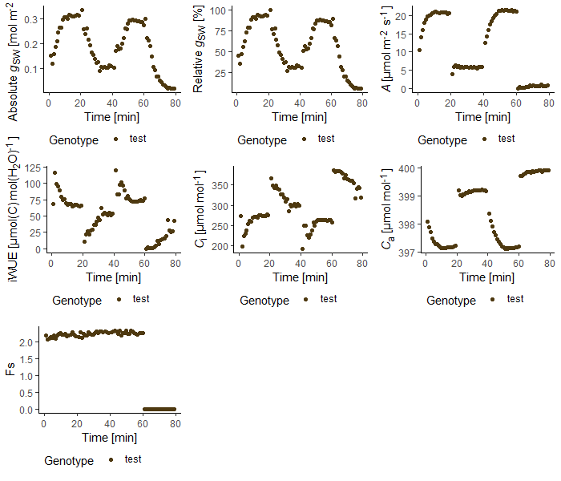
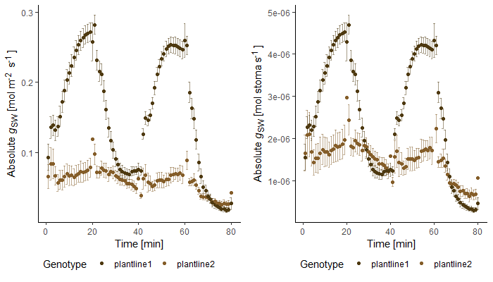
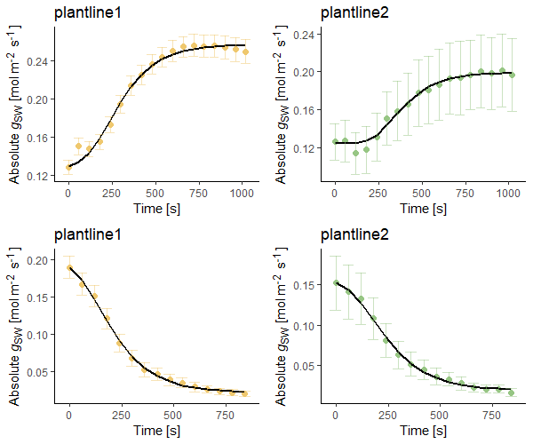

### How to download and install the package in R or R Studio
You can install the most recent version (v2.0.0) of licornetics from github with the following code:
```yaml
if (!require(devtools)) install.packages('devtools')
devtools::install_github("lbmountain/licornetics")
```

Next, load the package library (this needs to be done every time you restart your R session).
```yaml
library(licornetics)
```

<br /> 
<br />

### Licorplots (name changed from version 2.0.0 of licornetics onwards)

**Plot physiological parameters measured using the Li-COR biosystems photosystem.**

This function enables easy visualization of physiological parameters measured with a Li-COR portable photosystem.

It can plot absolute or relative stomatal conductance (_g<sub>SW</sub>_), carbon assimilation (_A_), intrinsic water-use efficiency (iWUE), intercellular CO<sub>2</sub> (_C_<sub>i</sub>) and ambient CO<sub>2</sub> (_C_<sub>a</sub>). Data from single files can be plotted as well as averaged data across several input files (with standard error or deviation bars) and different genotypes, species or conditions can be shown in one plot.

Licorplots is optimized for the use of Excel sheet files (**.xlsx**) created by the Li-6800 system.

As output, a plot is generated using the `ggplot2` package which can therefore be used downstream with ggplot-based packages such as `ggpubr`. Plot colours are added based on the "Isfahan1" palette from the `MetBrewer` package (https://github.com/BlakeRMills/MetBrewer) as a default but can also be customized with your own colour palette.


#### Updates included in version 2.0.0
- additional plotting option for Intercellular CO<sub>2</sub> and Ambient CO<sub>2</sub>
- **values can now be normalised by stomatal density with the `stomden` function**
- colours are more customisable now
- x axis depicts actual time in minutes calculated from measured timepoint now rather than based on the _obs_ column
- outlier removal is based on _A_ not iWUE now


#### How to use licorplots
##### **1. Basic usage**
The `licorplots` function included in the package can then be executed by using the following code:
```yaml
licorplots(identifier = "filename.xlsx")
```


Make sure that your files are in the folder you are currently working in (check with `getwd()`) or specify the path to where they are. If all files are in one specific folder you can also use `setwd("path/to/folder")` to go there before you use `licorplots`.

If the filename you are referring to has a unique identifier (such as "test" in the filename "testfile.xlsx"), you can also use this instead of the whole filename:
```yaml
licorplots(identifier = "test")
```


##### **2. Different plot types**
While the default setting of licorplots will yield a plot of data for absolute stomatal conductance, there are in total six plot types available which can be selected with the `type` argument:

1. **Absolute stomatal conductance** (`"gsw"`, _gsw_ in the excel files)

2. **Relative stomatal conductance** (`"relgsw"`), absolute stomatal conductance divided by the maximum value of the whole measurement

3. **Carbon assimilation rate** (`"A"`, _A_ in the excel files)

4. **Intrinsic Water-use efficiency** (`"WUE"`), Carbon assimilation rate divided by absolute stomatal conductance

5. **Intercellular CO<sub>2</sub>** (`"Ci"`, _Ci_ in the excel files) 

6. **Ambient Co<sub>2</sub>** (`"Ca"`, _Ca_ in the excel files)
```yaml
licorplots(identifier = "test", type = "gsw")
licorplots(identifier = "test", type = "relgsw")
licorplots(identifier = "test", type = "A")
licorplots(identifier = "test", type = "WUE")
licorplots(identifier = "test", type = "Ci")
licorplots(identifier = "test", type = "Ca")
```



##### **3. Merge data from different files**
If you want to plot averaged data from more than one file (with error bars (standard error)), simply change the `identifier` argument to a string of letters that are common to all the files you want to include such as "plantline1". Showing data from different file sets is also possible by using `c("plantline1", "plantline2")`.
```yaml
licorplots(identifier = "plantline1")
licorplots(identifier = c("plantline1", "plantline2"))
```


##### **4. Choose error bar type**
The default error bars shown in the plots are standard error (`"se"`) bars. If you want to change them to display standard deviation instead, set the `errorbars` argument to `"sd"`.


##### **5. Data correction by average leaf area and/or stomatal density**
When the leaf is not big enough to fill the entire LI-COR system chamber, gas exchange measurements should be corrected by leaf area. This can be done manually in the excel files or by using the `area_correction` argument of licorplots. Simply divide the chamber size by the average measured leaf area (e.g. 2cm<sup>2</sup>/0.8cm<sup>2</sup>=2.5) and add this value to the code:
```yaml
licorplots(identifier = "plantline1")
licorplots(identifier = "plantline1", area_correction = 2.5)
```


It is also possible to normalise your data by stomatal density to show your data on a per stoma basis. For this you need to give the stomatal density [stoma/mm<sup>-2</sup>] to the `stomden` argument. If you specified more than one identifier, you need to input the stomatal density for each identifier
in the same order as in the `identifier` argument.
```yaml
licorplots(identifier = c("plantline1", "plantline2"))
licorplots(identifier = c("plantline1", plantline2""), stomden = c(60, 40))
```



##### **6. Change axis limits**
If you want to modify the range of values displayed on the y axis, use the `y_axis_limits` argument:
```yaml
licorplots(identifier = "plantline1", y_axis_limits = c(0, 0.7))
licorplots(identifier = "plantline1", area_correction = 2.5, y_axis_limits = c(0, 0.7))
```


To change which x axis values are included, use `timeframe`:
```yaml
licorplots(identifier = "plantline1", timeframe = 25:65)
```


##### **7. Remove outliers**
If the `remove_outliers` argument is set to `"yes"`, licorplots will remove outliers based on boxplot outliers of the _A_ values (carbon assimilation).


##### **8. Further plot modifications**
Some more arguments are available to edit the final plot:

`timestamps` adds **dotted lines** based on the x axis values it is given.
```yaml
licorplots(identifier = "plantline1", timestamps = c(20, 40, 60))
```


`legend_title` allows to change the legend **title**. Default title is `"Genotype"`.

The **labels** of the legend can be modified by using `legend_labels`. The order of labels should follow the order of data given in the `identifier` argument. If `legend_labels` is not changed, the names used in `identifier` are displayed.
```yaml
licorplots(identifier = c("plantline1", "plantline2"), legend_title = "Species", legend_labels = c("Plant x", "Plant y"))
```


Licorplots uses the colour palette "Isfahan1" of the `MetBrewer` package as default colour palette (https://github.com/BlakeRMills/MetBrewer). You can
also use your own selection of colours or use another palette from `MetBrewer` or a similar package.
```yaml
licorplots(identifier = c("L1", "L2", "L3", "L4"))
licorplots(identifier = c("L1", "L2", "L3", "L4"), colours = met.brewer("Derain"))
licorplots(identifier = c("L1", "L2", "L3", "L4"), colours = c("blue", "green"))
licorplots(identifier = c("L1", "L2", "L3", "L4"), colours = c("#228B22", "#800080"))

```


#### Troubleshooting, tips and tricks for licorplots

We found that sometimes excel files were not read properly into R, leading to empty plots. In those cases it helped to open the excel file outside R Studio and save them again. Afterwards, R read in the data just fine.
Similarly, data could not be read into R when the file is still open in Excel so make sure to close the files before using the package.

It is highly recommended to keep the LI-COR input files in a folder that does not contain other files. If you did not specify a full file name as input but rather chose a fragment of it as identifier, licorplots will try to open all the files with this fragment that are in the folder and if there is a 
file with this fragment that is not a LI-COR excel output, it will cause an error.

If installation via `devtools` does not work, try replacing `devtools` in the code with `remotes`.


<br />
<br />
<br />


### Licorvalues (new in version 2.0.0 of licornetics)

**Calculate steady state values and kinetics parameters and plot regression curves from data measured using the Li-COR photosystem.**

This function calculates steady state values along with kinetics parameters based on Li-COR excel files.
It also visualises relative stomatal conductance and plots a regression curve onto the data.

The following values will be calculated:
1. **Steady state absolute stomatal conductance ("gsw")** with standard deviation and error (if `errorbars = "se` was selected).
2. **Steady state carbon assimilation ("A")** with standard deviation and error (if `errorbars = "se` was selected).
3. **Intrinsic water-use efficiency ("iWUE")** with standard deviation and error (if `errorbars = "se` was selected).
4. **Rate constant** of the curve.
5. **Half-time ("T50")** of opening or closing.

Licorvalues is optimized for the use of Excel sheet files (**.xlsx**) created by the Li-6800 system.

As output, a data frame/table containing the values is generated and the data with curves are depicted as plots.


<br />


#### How to use licorvalues
##### **1. Basic Usage**
Let's imagine you have ran a Li-COR program on several individuals of two genotypes in which you changed the light intensity each 20 minutes. Your final
plot that you created using the `licorplots` function might now look like this:


Now you want to have a closer look at the second opening transition at 41 to 59 minutes. You can use `licorvalues` to calculate steady state values
for the last 5 minutes of this time frame and it will also show you what the exponential decay curve looks like that was fitted over your data.
Similar to the `licorplots` function you name identifiers, here `"plantline1"` and `"plantline2"`, and then you give a list object to the `transition` argument that specifies the time frame that you want to calculate steady state and kinetics values for.

```yaml
licorvalues(identifier = c("plantline1", "plantline2"), transition = list(c(41:59)))
```
The output will then be a plot showing the data with the fitted curves:


and a table with the values that is printed to the console:
```
    genotype transition_zone       gsw      gsw_sd       gsw_se        A
2 plantline1           41:59 0.2500210 0.002745064 0.0012276297 17.53368
1 plantline2           41:59 0.1985915 0.002009115 0.0008985037 16.39369

        A_sd      A_se     iWUE   iWUE_sd   iWUE_se rate_constant      T50
2 0.06999676 0.0313035 71.43659 0.8333434 0.3726825     0.1667535 4.156717
1 0.03759949 0.0168150 86.42987 0.9092028 0.4066079     0.1117941 6.200213
```

If you want to save the table later, you can also save the output to an R object which will then include the table but not the plots:
```yaml
new_data <- licorvalues(identifier = c("plantline1", "plantline2"), transition = list(c(41:59)))
```

<br />


##### **2. Data correction by average leaf area**
When the leaf is not big enough to fill the entire LI-COR system chamber, gas exchange measurements should be corrected by leaf area. This can be done manually in the excel files or by using the `area_correction` argument of licorvalues. Simply divide the chamber size by the average measured leaf area (e.g. 2cm<sup>2</sup>/0.8cm<sup>2</sup>=2.5) and add this value to the code:
```yaml
licorvalues(identifier = "plantline1")
```

```
    genotype transition_zone      gsw      gsw_sd     gsw_se        A
2 plantline1           41:59 0.250021 0.002745064 0.00122763 17.53368

        A_sd      A_se     iWUE   iWUE_sd   iWUE_se rate_constant      T50
2 0.06999676 0.0313035 71.43659 0.8333434 0.3726825     0.1667535 4.156717
```

<br />
<br />

```yaml
licorvalues(identifier = "plantline1", area_correction = 2.5)
```
```
    genotype transition_zone       gsw      gsw_sd      gsw_se        A
2 plantline1           41:59 0.6250525 0.006862659 0.003069074 43.83421

       A_sd       A_se     iWUE   iWUE_sd   iWUE_se rate_constant      T50
2 0.1749919 0.07825876 71.43659 0.8333434 0.3726825     0.1667535 4.156717
```

<br />

##### **3. Data normalisation by stomatal density**
It is also possible to normalise your data by stomatal density to show your data on a per stoma basis. For this you need to give the stomatal density [stoma/mm<sup>-2</sup>] to the `stomden` argument. If you specified more than one identifier, you need to input the stomatal density for each identifier
in the same order as in the `identifier` argument.
```yaml
licorvalues(identifier = "plantline1")
```

```
    genotype transition_zone      gsw      gsw_sd     gsw_se        A       A_sd
2 plantline1           41:59 0.250021 0.002745064 0.00122763 17.53368 0.06999676

       A_se     iWUE   iWUE_sd   iWUE_se rate_constant      T50
2 0.0313035 71.43659 0.8333434 0.3726825     0.1667535 4.156717
```

<br />

```yaml
licorvalues(identifier = "plantline1", stomden = 60)
```

```
    genotype transition_zone          gsw       gsw_sd      gsw_se            A
2 plantline1           41:59 4.167016e-06 4.575106e-08 2.04605e-08 0.0002922281

          A_sd        A_se       iWUE      iWUE_sd      iWUE_se rate_constant
2 1.166613e-06 5.21725e-07 0.00119061 1.388906e-05 6.211375e-06     0.1667535

       T50
2 4.156717
```


<br />

##### **4. Outlier removal, standard error and standard deviation**
If `remove_outliers = "yes"`, licorvalues will remove outliers from the data based on boxplot outliers of the _A_ (carbon assimilation) column.

Licorvalues outputs a table with standard error and standard deviation values as the default along with plots depicting the data with standard error values. If you set the argument `errorbars = sd`, the plots will show standard deviation and the table will only include standard deviation but not standard error.


<br />

##### **5. Colours**
Per default, plots are depicted in black but you can also customise this by adding a colour palette via the `colours` argument that assigns a colour
to each identifier.
```yaml
licorvalues(identifier = c("plantline1", "plantline2"), transition = list(c(41:59), c(61:75)), colours = met.brewer("Derain"))
```

```
     genotype transition_zone        gsw      gsw_sd       gsw_se          A
2  plantline1           41:59 0.25002099 0.002745064 0.0012276297 17.5336849
1  plantline1           61:75 0.02693562 0.004860572 0.0021737137 -0.9172865
11 plantline2           41:59 0.19859154 0.002009115 0.0008985037 16.3936853
12 plantline2           61:75 0.02550996 0.005165314 0.0023099984 -1.0230697

         A_sd       A_se       iWUE     iWUE_sd     iWUE_se rate_constant      T50
2  0.06999676 0.03130350   71.43659   0.8333434   0.3726825     0.1667535 4.156717
1  0.04142863 0.01852745 -180.21156 238.4259830 106.6273411     0.2266650 3.058025
11 0.03759949 0.01681500   86.42987   0.9092028   0.4066079     0.1117941 6.200213
12 0.08053374 0.03601579  -53.34118  11.4081815   5.1018938     0.2182721 3.175611
```



